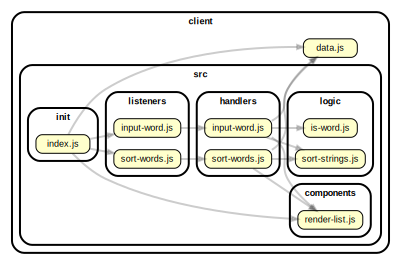

<!-- BEGIN TITLE -->

# DOCS

<!-- END TITLE -->

<!-- BEGIN TREE -->

> [interactive graph](./dependency-graph.html)



<!-- END TREE -->

<!-- BEGIN TOC -->

- public
- src
  - components
    - [render-list.js](#clientsrccomponentsrender-listjs)
  - handlers
    - [input-word.js](#clientsrchandlersinput-wordjs)
    - [sort-words.js](#clientsrchandlerssort-wordsjs)
  - init
    - [index.js](#clientsrcinitindexjs)
  - listeners
    - [input-word.js](#clientsrclistenersinput-wordjs)
    - [sort-words.js](#clientsrclistenerssort-wordsjs)
  - logic
    - [is-word.js](#clientsrclogicis-wordjs)
    - [sort-strings.js](#clientsrclogicsort-stringsjs)
- styles
- [data.js](#clientdatajs)

---

<!-- END TOC -->

<!-- BEGIN DOCS -->

# /public

---

# /src

## /components

<details><summary><a href="../../client/src/components/render-list.js" id="clientsrccomponentsrender-listjs">../client/src/components/render-list.js</a></summary>

<a name="renderList"></a>

## renderList ⇒ <code>string</code>

A function that renders HTML elements in an un-ordered list from an array.

**Returns**: <code>string</code> - Will return un-ordered list and list items in a string.

| Param    | Type               | Description                    |
| -------- | ------------------ | ------------------------------ |
| toRender | <code>Array</code> | The array to render into list. |

**Example**

```js
// [door, window, closet, table] -- '<ul><li>door</li><li>window</li><li>closet</li><li>table</li></ul>
```

</details>

---

## /handlers

<details><summary><a href="../../client/src/handlers/input-word.js" id="clientsrchandlersinput-wordjs">../client/src/handlers/input-word.js</a></summary>

<a name="inputWord"></a>

## inputWord

Entry point for users adding a word to the list.
It is called each time the user clicks the "add word" button.

| Param | Type               | Description                                          |
| ----- | ------------------ | ---------------------------------------------------- |
| event | <code>Event</code> | The event triggered when the user clicks the button. |

</details>

<details><summary><a href="../../client/src/handlers/sort-words.js" id="clientsrchandlerssort-wordsjs">../client/src/handlers/sort-words.js</a></summary>

<a name="sortWords"></a>

## sortWords

Entry point for users sorting the list of words in this app.
It is called each time the input selection changes.

| Param | Type               | Description                                |
| ----- | ------------------ | ------------------------------------------ |
| event | <code>Event</code> | The event triggered by changing the input. |

</details>

---

## /init

<details><summary><a href="../../client/src/init/index.js" id="clientsrcinitindexjs">../client/src/init/index.js</a></summary>

</details>

---

## /listeners

<details><summary><a href="../../client/src/listeners/input-word.js" id="clientsrclistenersinput-wordjs">../client/src/listeners/input-word.js</a></summary>

</details>

<details><summary><a href="../../client/src/listeners/sort-words.js" id="clientsrclistenerssort-wordsjs">../client/src/listeners/sort-words.js</a></summary>

</details>

---

## /logic

<details><summary><a href="../../client/src/logic/is-word.js" id="clientsrclogicis-wordjs">../client/src/logic/is-word.js</a></summary>

<a name="isWord"></a>

## isWord ⇒ <code>boolean</code>

Checks if a string is a word. A word contains only letters.

**Returns**: <code>boolean</code> - Whether or not the text is a word.

| Param | Type                | Description                      |
| ----- | ------------------- | -------------------------------- |
| text  | <code>string</code> | A string to check for wordiness. |

**Example**

```js
// roger -- true
```

**Example**

```js
// spell-check -- false
```

</details>

<details><summary><a href="../../client/src/logic/sort-strings.js" id="clientsrclogicsort-stringsjs">../client/src/logic/sort-strings.js</a></summary>

</details>

---

---

# /styles

---

<details><summary><a href="../../client/data.js" id="clientdatajs">../client/data.js</a></summary>

<a name="data"></a>

## data

**Properties**

| Name  | Type                              | Description                                                         |
| ----- | --------------------------------- | ------------------------------------------------------------------- |
| words | <code>Array.&lt;string&gt;</code> | An array of words that the user has provided.                       |
| sort  | <code>string</code>               | A string indicating the order string should be displayed in the UI. |

</details>

<!-- END DOCS -->
